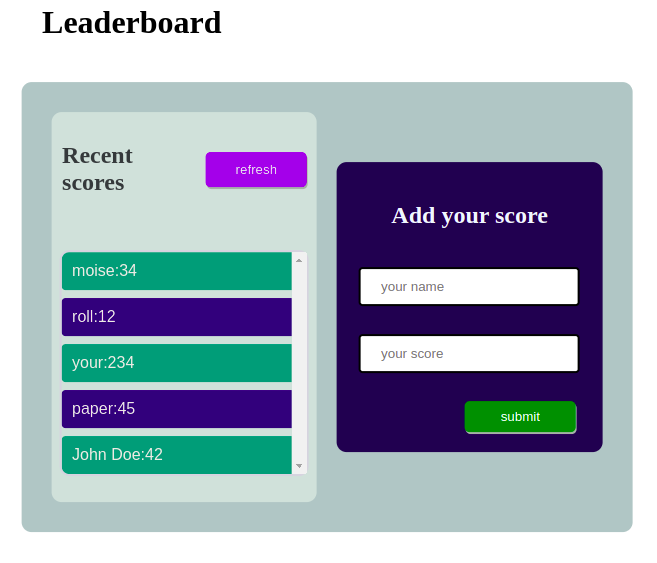

# TLeaderboard
In this app i display the leaderboard and its differents contents.
This app 


# Leaderboard :   final touches

> Open with with the server

.

## Built With

- HTML
- CSS
- JavaScript ES6/Modules
- Webpack
- Visual Studio Code.
- Linters
- Gitflow
- API `(https://us-central1-js-capstone-backend.cloudfunctions.net/api/games/ 9rTfnXYuiz3fkEn4zX0n/scores/)`

## Live Demo

[github page](https://github.com/moise-mulungu/Leaderboard-project)

[live demo](https://moise-mulungu.github.io/Leaderboard-project/dist/)

## Getting Started

To get a local copy of this app you can use :
```
git clone  https://github.com/moise-mulungu/Leaderboard-project
```
# Install

- After cloning run `npm install`

# Usage

`npm install -g live-server` after run
`live-server`

## Author

👤 **Moise Mulungu**

- GitHub: [Moise Mulungu](https://github.com/moise-mulungu)
- Twitter: [Moise Mulungu](https://twitter.com/moise_mulungu)
- LinkedIn: [Moise Mulungu](https://www.linkedin.com/in/mo%C3%AFse-mulungu-a939831b2/)

## 🤝 Contributing

Contributions, issues, and feature requests are welcome!

Feel free to check the [issues page](https://github.com/moise-mulungu/Leaderboard-project/issues).


## Show your support

Give a ⭐️ if you like this project!

## 📝 License

This project is [MIT](./MIT.md) licensed.
 
